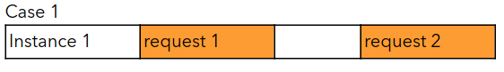
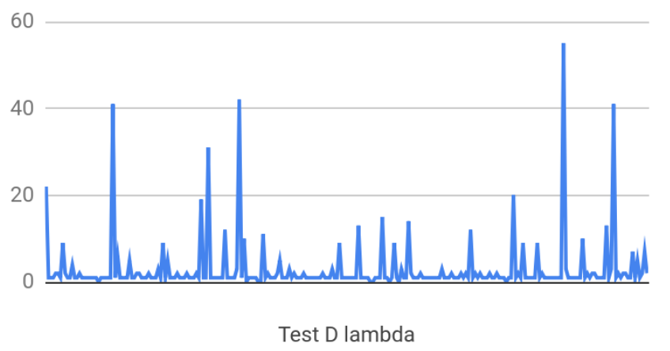
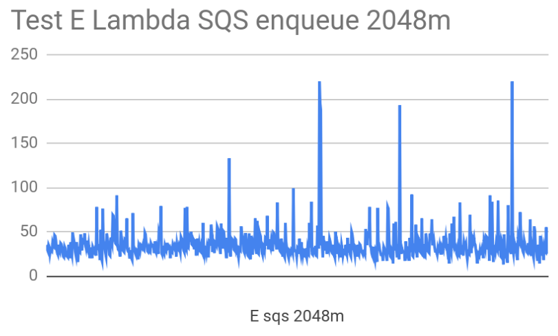
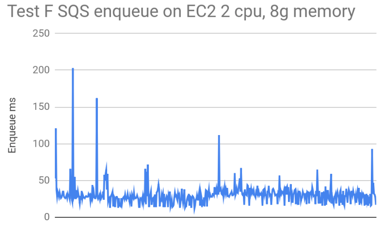

# AWS Lambda performance exploration

| The work presented here is done by Intuit Futures team. 20190403 |

As one benefit of a serverless architecture, Lambda has simplified performance tuning for development teams. 
Developers can focus on coding and have less concerns over the conventional performance issues. 
The allocation of the share of CPU time are related to Lambda Memory configuration.

The down side of the autoscaling is what's called a "cold start". 
This occurs when there are no requests incoming for a given Lambda instance, deeming it idle. 
Once an instance idled for awhile, it may be removed to release resources. 
When another request to come in, and all lambda instances are busy, a new Lambda instance will be initialized to serve the request. 
For more information, refer to Concept of cold start section.

In your Lambda code, you can create concurrent or parallel threads. But once the main thread stops, all child threads will be stopped. This is useful since you are charged by how long your function runs for, so you can perform multiple tasks at once.

The performance tests were done on a Lambda that we developed.

- It is triggered by an upstream SQS queue
- It performs a small JSON message transformation
    - JSON transformation takes about 1 ms to complete on an i7 CPU
- Then the new JSON is sent to three downstream SQS queues
    - SQS enqueue operation requires TLS handshake. It requires more CPU time in our test cases. It takes 30 ms on a T2.large EC2 instance
- The downstream SQS publishing is done in three separate promises

The workload that we simulated in this exploration:
- 10 concurrent clients
- Each client sends 1 request per second
- Each message in size is 1.5k bytes
- Test duration: 1 minute

## Concept of cold start 
Cold start refers to a request being handled by a new Lambda instance. 
When a Lambda instance is being created, the code needs to be copied and unpacked, 
along with other initialization tasks. The result will be that the client 
will experience a slower response time. 
It is related to Lambda scaling behavior, and as a developer, we don’t have direct control of it.

The chart below shows what may happen with two Lambdas having different execution times. 
In case 1, we have two separate requests with some time in-between. 
This means that the same instance can handle both requests.

With case 2, we also have two requests, but this time the second request arrives 
while the first one is still being handled. 
This means an additional instance is created to handle that request.

Depends on your interest, you can implement solutions to keep your lambda warm. 
For example using AWS Batch service to schedule a job to call
your lambda every 10 minutes. You will need to simulate concurrent requests.

## Configure Memory
Lambda exposes only "Memory" setting as the control for resource allocation.

"Specify the amount of memory you want to allocate for your Lambda function. 
AWS Lambda allocates CPU power proportional to the memory by using the same ratio 
as a general purpose Amazon EC2 instance type, such as an M3 type. 
For example, if you allocate 256 MB memory, your Lambda function will 
receive twice the CPU share than if you allocated only 128 MB."
  [https://docs.aws.amazon.com/lambda/latest/dg/resource-model.html ](https://docs.aws.amazon.com/lambda/latest/dg/resource-model.html)

The chart below shows six data points collected from our experiment. 
Our Lambda receives events from an SQS source, converts the message, then sends it to three downstream SQS queues.

The six data points are average Lambda execution times related to different memory settings.

|     | 128m | 256m | 512m | 1024m | 2048m | 3008m |
| --- | ---: | ---: | ---: | ---: | ---: | ---: |
| *Lambda (ms)* | 386 | 174 | 88 | 53 | 52 | 53 |
| *SQS send (ms)* | 270 | 130 | 62 | 37 | 35 | 35 |

One thing that's different, from our observation, the execution time is “spiky”. 
The execution time has noticeable standard deviations. Although they are in proportion 
to average execution time. 
To illustrate the spikiness, here is one chart of the execution time during one of our tests:

The x-axis is each lambda call. The y-axis is execution time in ms. It makes sense, 
that the resource of lambda servers are shared with all Lambda customers. The allocated resource 
is probably not reserverd and idle when our lambda is idle. 

## Configure Timeout

"You pay for the AWS resources that are used to run your Lambda function. 
To prevent your Lambda function from running indefinitely (15 minutes), 
you specify a timeout. When the specified timeout is reached, 
AWS Lambda terminates execution of your Lambda function. 
We recommend you set this value based on your expected execution time. 
The default timeout is 3 seconds." 
  [https://docs.aws.amazon.com/lambda/latest/dg/resource-model.html](https://docs.aws.amazon.com/lambda/latest/dg/resource-model.html)

What needs to be considered:
- 15 minutes is the maximum timeout that AWS allows.
- Chooce between “fail fast” vs. “success for cold starts”

Your timeout length depends on the customer experience and cost. 
If you have a short timeout, the function will fail before it runs too long. 
With longer timeouts, the cost and response time can be greater. 
Finding a balance is important.

## Configure Reserved Concurrency

Each AWS account has a limit of total concurrent executions. 
It’s across all functions within a region. The default is 1000. It can be changed.

When the total concurrent limit is reached, lambda requests will be throttled.

The limit is enforced against the sum of all lambdas by default. 
Which may become a problem. We may have critical services 
which we can reserve concurrency from the total concurrent limit, 
so that when a surge of requests happened to other lambdas, 
these critical services are still have concurrency reserved.

[https://docs.aws.amazon.com/lambda/latest/dg/concurrent-executions.html](https://docs.aws.amazon.com/lambda/latest/dg/concurrent-executions.html)
[https://docs.aws.amazon.com/lambda/latest/dg/scaling.html](https://docs.aws.amazon.com/lambda/latest/dg/scaling.html)

## Pricing
Lambda cost is calculated by memory-time. It’s done using this formula:

Cost = memory size X execution time

Execution time is rounded up to the nearest 100ms. 
Memory size changes by 64m.

Using the price plan provided by AWS, the cost of calling the Lambda 1 million times:

|   | 128m | 256m | 512m | 1024m |
| --- | ---: | ---: | ---: | ---: |
| *Execution time (ms)* | 386 | 174 | 88 | 53 |
| *Lambda x 1,000,000 round to 100ms* | 400000000 | 200000000 | 100000000 | 100000000 |
| *Cost per 100ms*| 0.000000208 | 0.000000417 | 0.000000834 | 0.000001667 |
| *Cost ($)* | 83.2 | 83.4 | 83.4 | 166.7 |

## Comparing to EC2
To better understand Lambda behaviour, we ran the same logic on an T2.large EC2 instance. 
The following diagrams show how much time Lambda and EC2 needed to send messages to our SQS.
Average times:

|   | SQS call | Whole Function |   |
| --- | ---: | ---: | ---: | ---: | --- |
| EC2 | 30ms | 31ms |   |
| Lambda | 35ms | 50ms |   |

1. EC2 needs 30 ms on average
2. Lambda needs 35 ms on average
3. EC2 needs 31 ms in average to complete each call
4. Lambda requires 19 ms extra execution time - 50 ms average to complete each call
5. Lambda execution time is less consistent. We believe it is likely caused by shared hardware on AWS

## Other performance related learnings
1. Understanding scaling behavior: [https://docs.aws.amazon.com/lambda/latest/dg/scaling.html](https://docs.aws.amazon.com/lambda/latest/dg/scaling.html)
2. The main process access to resources is limited to life time of the request. Execution context will freeze lambda once the main task complete. 
    a. Child process, if not completed, will resume when lambda instance called again. (not verified)
    b. Have file access to /tmp
3. HTTPS keepAlive can save 70% of the network time. In our case, the time needs to send a message to SQS, is reduced to 25% of the time without keepAlive.  [https://theburningmonk.com/2019/02/lambda-optimization-tip-enable-http-keep-alive/](https://theburningmonk.com/2019/02/lambda-optimization-tip-enable-http-keep-alive/)
4. DoS attack maybe a concern

Further reading:
1. An exploration with Lambda performance: [https://epsagon.com/blog/best-practices-for-aws-lambda-timeouts/](https://epsagon.com/blog/best-practices-for-aws-lambda-timeouts/)
2. Compare language performance [https://read.acloud.guru/comparing-aws-lambda-performance-of-node-js-python-java-c-and-go-29c1163c2581](https://read.acloud.guru/comparing-aws-lambda-performance-of-node-js-python-java-c-and-go-29c1163c2581)
3. A Lambda cost discussion: [https://www.slideshare.net/TimWagner/serverlessconf-2017-keynote-debunking-serverless-myths](https://www.slideshare.net/TimWagner/serverlessconf-2017-keynote-debunking-serverless-myths)

----------------
[home](../README.md)

