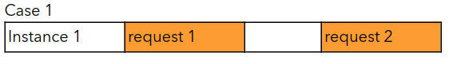
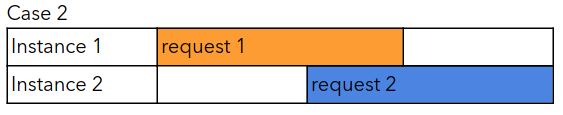
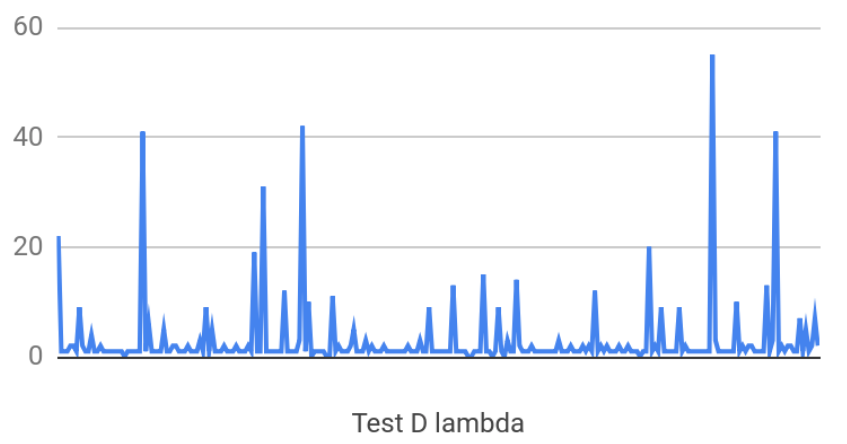

# AWS Lambda performance exploration

| The work presented here is done by Intuit Futures team. 20190403 |

As one benefit of a serverless architecture, Lambda has simplified performance tuning for development teams. 
Developers can focus on coding and have less concerns over the conventional performance issues. 
The allocation of the share of CPU time are related to Lambda Memory configuration.

The down side of the autoscaling is what’s called a “cold start”. This occurs when there are no requests incoming for a given Lambda instance, deeming it idle. 
Once an instance idled for awhile, it may be removed to release resources. 
When another request to come in, and all lambda instances are busy, a new Lambda instance will be initialized to serve the request. 
For more information, refer to Concept of cold start section.

In your Lambda code, you can create concurrent or parallel threads. But once the main thread stops, all child threads will be stopped. This is useful since you are charged by how long your function runs for, so you can perform multiple tasks at once.

The performance tests were done on a Lambda that we developed.

- It is triggered by an upstream SQS queue
- It performs a small JSON message transformation
    - JSON transformation takes about 1 ms to complete on an i7 CPU
- Then the new JSON is sent to three downstream SQS queues
    - SQS enqueue operation requires TLS handshake. It requires more CPU time in our test cases. It takes 30 ms on a T2.large EC2 instance
- The downstream SQS publishing is done in three separate promises

The workload that we simulated in this exploration:
- 10 concurrent clients
- Each client sends 1 request per second
- Each message in size is 1.5k bytes
- Test duration: 1 minute

## Concept of cold start 
Cold start refers to a request being handled by a new Lambda instance. 
When a Lambda instance is being created, the code needs to be copied and unpacked, 
along with other initialization tasks. The result will be that the client 
will experience a slower response time. 
It is related to Lambda scaling behavior, and as a developer, we don’t have direct control of it.

The chart below shows what may happen with two Lambdas having different execution times. 
In case 1, we have two separate requests with some time in-between. 
This means that the same instance can handle both requests.

With case 2, we also have two requests, but this time the second request arrives 
while the first one is still being handled. 
This means an additional instance is created to handle that request.

Depends on your interest, you can implement solutions to keep your lambda warm. 
For example using AWS Batch service to schedule a job to call
your lambda every 10 minutes. You will need to simulate concurrent requests.

## Configure Memory
Lambda exposes only "Memory" setting as the control for resource allocation.

“Specify the amount of memory you want to allocate for your Lambda function. 
AWS Lambda allocates CPU power proportional to the memory by using the same ratio 
as a general purpose Amazon EC2 instance type, such as an M3 type. 
For example, if you allocate 256 MB memory, your Lambda function will 
receive twice the CPU share than if you allocated only 128 MB.”
  https://docs.aws.amazon.com/lambda/latest/dg/resource-model.html

The chart below shows six data points collected from our experiment. 
Our Lambda receives events from an SQS source, converts the message, then sends it to three downstream SQS queues.

The six data points are average Lambda execution times related to different memory settings.

|  | 128m | 256m | 512m | 1024m | 2048m | 3008m |
| --- | ---: | ---: | ---: | ---: | ---: | ---: |
| Lambda (ms) | 386 | 174 | 88 | 53 | 52 | 53 |
| SQS send (ms) | 270 | 130 | 62 | 37 | 35 | 35 |

One thing that's different, from our observation, the execution time is “spiky”. 
The execution time has noticeable standard deviations. Although they are in proportion 
to average execution time. 
To illustrate the spikiness, here is one chart of the execution time during one of our tests:

The x-axis is each lambda call. The y-axis is execution time in ms.
